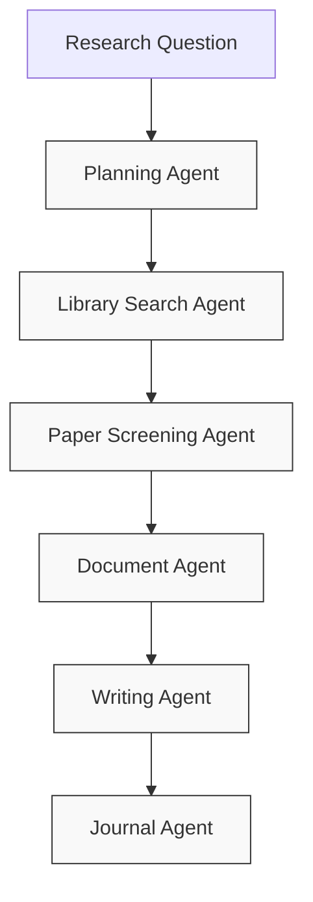

<div align="center">
  
# 🧠 Synaptheum

### *Where The Power of AI Meets Academic Knowledge*

[](https://opensource.org/licenses/MIT)
[](https://www.python.org/downloads/)
[](https://openai.com/)
[]()

</div>

---

## 🔄 Research Redefined

**Synaptheum** is a comprehensive research assistant application that automate part of your academic workflow (at least for reviews) using OpenAI's Agents SDK and Computer Use capabilities. Like the synaptic connections in your brain, Synaptheum weaves together various research processes into one seamless experience.


## ✨ Features

<table>
  <tr>
    <td width="50%">
      <h3>🔍 Research Question Analysis</h3>
      <p>Breaks down complex research questions into searchable components with semantic understanding</p>
    </td>
    <td width="50%">
      <h3>📚 UCalgary Library Integration</h3>
      <p>Automatically logs in, searches for papers, and downloads relevant results. (Need to be a UCalgary student or faculty)</p>
    </td>
  </tr>
  <tr>
    <td width="50%">
      <h3>📋 Paper Screening</h3>
      <p>Evaluates and selects the most relevant papers for your research using AI-powered analysis</p>
    </td>
    <td width="50%">
      <h3>📁 Google Drive Integration</h3>
      <p>Creates and organizes research documents automatically in your Drive</p>
    </td>
  </tr>
  <tr>
    <td width="50%">
      <h3>✍️ Academic Writing</h3>
      <p>Generates well-structured content with proper citations and bibliography</p>
    </td>
    <td width="50%">
      <h3>📰 Journal Recommendations</h3>
      <p>Suggests appropriate journals for publication based on acceptance rates and impact factors</p>
    </td>
  </tr>
  <tr>
    <td colspan="2">
      <h3>📝 Journal-Specific Formatting</h3>
      <p>Formats papers according to target journal style guidelines, including citation format, word count, and section requirements</p>
    </td>
  </tr>
</table>

## 🛠️ How It Works

Synaptheum orchestrates a team of specialized AI agents, each dedicated to a specific part of the research process:



Each agent is powered by specialized OpenAI models optimized for their specific tasks, from the reasoning-focused O1 for planning to the Computer Use model for browser automation.

## 🚀 Setup Instructions

1. **Clone this repository:**

```bash
git clone https://github.com/yourusername/synaptheum.git
cd synaptheum
```

2. **Install dependencies:**

```bash
pip install -r requirements.txt
```

3. **Install Playwright browsers:**

```bash
playwright install
```

4. **Create a `.env` file with your configuration:**

```ini
# OpenAI API Key
OPENAI_API_KEY=your_api_key_here

# Main models for various tasks
OPENAI_AGENT_MODEL=gpt-4o
OPENAI_PLANNING_MODEL=o1
OPENAI_COMPUTER_USE_MODEL=computer-use-preview
# Additional configuration...
```

5. **[Optional] Update credentials in `main.py` if needed**

## 🔄 Usage

Run the main script and enter your research question when prompted:

```bash
python main.py
```

The application will:

1. 🧠 Analyze your research question
2. 🔍 Search the UCalgary library for relevant papers
3. 📊 Screen and select the most appropriate papers
4. 📝 Create a structured Google Doc
5. ✍️ Write a complete academic paper
6. 🎯 Format according to journal guidelines (if specified)
7. 📚 Recommend journals for publication

## 🔒 Security Note

This application requires your UCalgary and Google credentials. For security, you may want to:

1. 🛡️ Update the security.py file to use a secure credential store
2. 🔐 Run the application in a sandboxed environment
3. 🔄 Reset any passwords after using the application

## 📋 Requirements

* Python 3.8+
* OpenAI API key with access to GPT-4o and Computer Use preview
* UCalgary library credentials
* Google account credentials

## 🔮 Future Enhancements

This implementation provides the core functionality, but could be enhanced with:

- **📊 More sophisticated paper analysis using the full text of PDFs**
  - Deep semantic understanding of complex research methodologies
  - Extraction of key tables, figures, and statistical results
  - Automatic identification of strengths and limitations in methodology

- **🕸️ Citation graph analysis to identify seminal papers**
  - Build citation networks to identify foundational papers in the field
  - Track the evolution of ideas through citation patterns
  - Identify emerging research fronts and trending sub-topics

- **🧩 Advanced journal matching algorithms**
  - Machine learning models to predict acceptance probability
  - Analysis of editorial board research interests
  - Tracking of acceptance rates over time

## 👥 Contribute & Make It Your Own

<div align="center">
  
### ⚠️ DISCLAIMER ⚠️

**Synaptheum is a community-driven project that needs YOUR contributions to thrive!**

</div>

This project exists as a foundation for researchers, developers, and academic institutions to build upon. We strongly encourage you to:

- **Fork the repository** and adapt it to your specific research workflows
- **Create your own version** tailored to your field, institution, or personal needs
- **Share your improvements** with the broader academic community
- **Join our growing network** of researchers revolutionizing academic work

The code provided here is deliberately open-ended and adaptable. While functional, it requires contributors to reach its full potential. We believe in the power of collaborative development to transform academic research in the AI age.

**Please use this code as a starting point to build something amazing.** Whether you're improving the core functionality, adapting it to different academic disciplines, or creating specialized tools for your institution - your contributions are essential.

We've made Synaptheum open-source because we believe in democratizing access to cutting-edge research tools. Help us make this vision a reality!

## 📜 License

This project is licensed under the MIT License - see the LICENSE file for details.

---

<div align="center">
  <p>Made with ❤️ by researchers, for researchers</p>
  <p>© 2025 Synaptheum</p>
</div>
